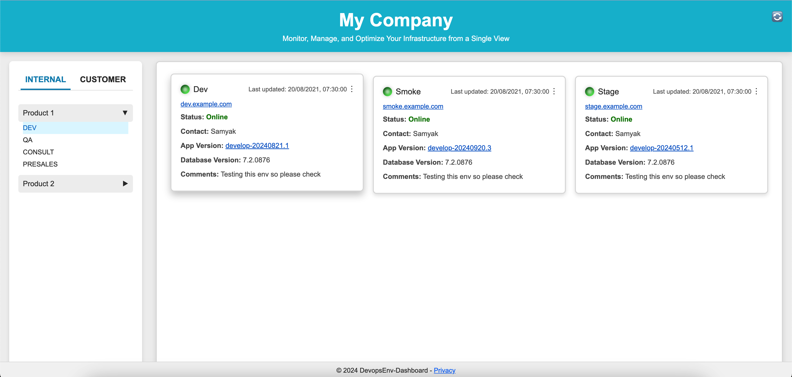

# Infra Environment Dashboard

Infra Environment Dashboard is a web application that helps teams manage and visualize infrastructure environments across different infra types like **INTERNAL** (for internal development) and **CUSTOMER** (for customer-specific environments). The dashboard is highly configurable using the database, meaning if the correct data is entered into the database, it will automatically flow into the dashboard without additional configuration. The dashboard makes it easy to see each environment’s status, grouped by products or customers. The dashboard is highly configurable using the database, and as long as the data is correct in the database, the information will seamlessly flow into the UI for easy visualization.

## Features



- **Company Service**: Provides company information.
- **Environment Service**: Lists environment types, sections, and groups under INTERNAL and CUSTOMER infra types.
- **Frontend Dashboard**: User-friendly interface to view and manage environments in one place.

## Project Structure

The project is divided into multiple services and components:

```plaintext
infra_env_dashboard
├── backend               # Backend services and configurations
│   ├── common            # Common utilities for config, logging, and DB connection
│   │   ├── configs
│   │   │   └── config.yaml          # Configuration file for database and service settings
│   │   ├── httpservice
│   │   │   └── http_service.go      # Common HTTP client or server utilities
│   │   ├── logger
│   │   │   └── logger.go            # Logger setup for consistent logging across services
│   │   ├── postgress
│   │   │   └── db.go                # PostgreSQL database connection setup
│   │   └── utils
│   │       └── error_handler.go     # Utility functions for error handling
│   ├── services
│   │   ├── fetch_company_details    # Service for company details
│   │   │   ├── docs
│   │   │   │   ├── docs.go          # Swagger documentation setup
│   │   │   │   ├── swagger.json     # API specification in JSON format
│   │   │   │   └── swagger.yaml     # API specification in YAML format
│   │   │   ├── handlers
│   │   │   │   └── company_handler.go # HTTP handlers for company-related requests
│   │   │   ├── main.go              # Entry point for the service
│   │   │   ├── models
│   │   │   │   ├── company.go       # Data models for company-related entities
│   │   │   │   └── response.go      # Models for API responses
│   │   │   ├── repository
│   │   │   │   └── company_repository.go # Database interaction for company details
│   │   │   └── router
│   │   │       └── router.go        # HTTP router setup for handling API routes
│   │   └── fetch_infra_types        # Service for infra types and environment details
│   │       ├── docs
│   │       │   ├── docs.go          # Swagger documentation setup
│   │       │   ├── swagger.json     # API specification in JSON format
│   │       │   └── swagger.yaml     # API specification in YAML format
│   │       ├── handlers
│   │       │   └── infra_handler.go # HTTP handlers for infra-related requests
│   │       ├── main.go              # Entry point for the service
│   │       ├── models
│   │       │   ├── infra_type.go    # Data models for infra type entities
│   │       │   └── response.go      # Models for API responses
│   │       ├── repository
│   │       │   └── infra_repository.go # Database interaction for infra types
│   │       └── router
│   │           └── router.go        # HTTP router setup for handling API routes
├── database              # Database initialization SQL files
│   └── 000_create_database_schema.sql # SQL script to create the initial database schema
├── frontend              # Frontend React application
│   ├── assets            # Static assets like images, fonts, etc.
│   ├── public
│   │   └── config        # Public configurations, if any
│   ├── src
│   │   ├── App.js        # Main entry point of the React app
│   │   ├── components    # Reusable UI components
│   │   │   ├── AppVersionModal.js   # Component for displaying app version information
│   │   │   ├── Card.js              # Card component for displaying environment details
│   │   │   ├── Header.js            # Header component for the app
│   │   │   ├── MainContent.js       # Main content display of the dashboard
│   │   │   ├── Modal.js             # Generic modal component
│   │   │   ├── SectionHeader.js     # Section header component
│   │   │   ├── Sidebar.js           # Sidebar component for navigation
│   │   │   └── TileContainer.js     # Container for tiles within each section
│   │   ├── index.css     # Global CSS styles
│   │   ├── index.html    # HTML template for the React app
│   │   ├── index.js      # Entry point for rendering React components
│   │   └── styles        # CSS styles for individual components
│   │       ├── App.css              # Styles for the main App component
│   │       ├── AppVersionModal.css  # Styles for the AppVersionModal component
│   │       ├── Card.css             # Styles for the Card component
│   │       ├── Header.css           # Styles for the Header component
│   │       ├── MainContent.css      # Styles for the MainContent component
│   │       ├── Modal.css            # Styles for the Modal component
│   │       ├── SectionHeader.css    # Styles for the SectionHeader component
│   │       ├── Sidebar.css          # Styles for the Sidebar component
│   │       └── TileContainer.css    # Styles for the TileContainer component
└── docker-compose.yml    # Docker Compose file to run the whole application
```

## Getting Started

### Prerequisites

- **Docker** and **Docker Compose** installed on your system.

### Installation

1. **Clone the repository**:
   ```bash
   git clone https://github.com/yourusername/infra_env_dashboard.git
   cd infra_env_dashboard
   ```

2. **Setup environment variables** (Optional):
   - You may adjust database user and password in `docker-compose.yml` if needed.

3. **Run the application**:
   ```bash
   docker-compose up --build
   ```

   This will build and run the services:
   - **PostgreSQL Database** on port `5432`
   - **Company Service** (backend) on port `8081`
   - **Environment Service** (backend) on port `8082`
   - **Frontend** on port `3000`

4. **Access the dashboard**:
   Open [http://localhost:3000](http://localhost:3000) in your web browser.

### Project Components

- **Backend Services**:
  - `fetch_company_details`: Provides details about the company.
  - `fetch_infra_types`: Lists infra types, sections, and groups for managing different environments.
- **Frontend**:
  - Built with React. This provides a user interface to display and manage all environments based on infra type.

### Database Setup

- **Database**: PostgreSQL is used as the database for storing company, infra types, sections, environment groups, and environments.
- **Schema**: The `database/000_create_database_schema.sql` file initializes the database tables and relations.

### API Endpoints

Each backend service has its own API endpoints:

1. **Company Service** (`fetch_company_details`):
   - `GET /company` - Retrieves company details.

2. **Environment Service** (`fetch_infra_types`):
   - `GET /infra_types` - Fetches infra types, sections, and groups.

Check the API documentation (Swagger) for detailed endpoint information.

### Environment Variables

- **Best Practices for Credentials**: For local development, you can use `config.yaml` to store database connection details and other configurations. However, for production environments, it is highly recommended to use secure methods like **HashiCorp Vault**, **AWS Secrets Manager**, or another secrets management service to avoid storing sensitive information (such as passwords or API keys) directly in code or configuration files. This helps ensure that true production passwords are not leaked or stored in Git.

- **DATABASE_URL**: Used by backend services to connect to the PostgreSQL database. Set up automatically in `docker-compose.yml`.

### File Structure

- **backend/common**: Common files like database connection (`db.go`), HTTP service handlers (`http_service.go`), and logging setup (`logger.go`).
- **backend/services**: Each service has its own folder with code, handlers, models, repository, and routing.
- **frontend**: Contains the React code for the dashboard UI.

### Contributing

If you’d like to contribute:

1. Fork the repo
2. Create a new branch (`git checkout -b feature-name`)
3. Commit changes (`git commit -am 'Add new feature'`)
4. Push the branch (`git push origin feature-name`)
5. Open a pull request

### License

This project is licensed under the MIT License.